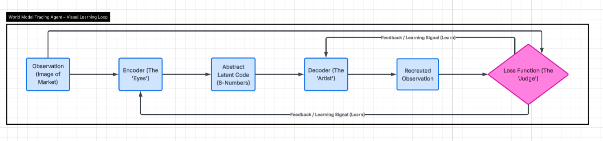

# AXIOM

AXIOM is an experimental world-model project focused on validating a strong representation-learning foundation before expanding into more advanced reasoning or decision-making systems. The current goal is not to ship a finished end-to-end product, but to prove that the core architecture can learn stable, reusable internal representations in controlled settings.

At its current stage, AXIOM learns an internal model of visual data by compressing observations into a latent space, reconstructing them through a decoder, and using reconstruction quality as the training signal. This makes it possible to test whether the model is learning meaningful internal structure before introducing higher-level modules.

---

## Visual Architecture

The diagram below shows the current VAE training loop used in the project.

---

## What AXIOM Does

AXIOM currently focuses on the following pipeline:

- **Preprocess and cache input data** to support repeatable experiments and reduce training overhead.
- **Encode observations into a latent space** that captures important structure in a compact form.
- **Decode latent representations back into observations** to measure how much useful information has been preserved.
- **Train through reconstruction loss** so the encoder and decoder improve together.
- **Export latent statistics and model components** for reuse without retraining the full pipeline.
- **Test memory-style reconstruction** by training secondary decoding stages from stored latent states.

This setup allows the project to evaluate whether the learned latent space is compact, stable, and reusable rather than simply memorizing raw inputs.

---

## Architecture Overview

### 1. Data Preparation and Caching
Inputs are preprocessed and cached to keep experiments reproducible and training efficient.

### 2. Encoding / Representation Learning
An encoder transforms observations into a compressed latent representation that captures key structural features while reducing raw complexity.

### 3. Latent Space Formation
The latent layer acts as the model’s internal state: compact enough to store and compare, but rich enough to support reconstruction.

### 4. Decoding / Reconstruction
A decoder reconstructs observations from the latent representation, providing a direct test of what the model has retained.

### 5. Loss-Driven Feedback
The reconstruction is compared with the original input, and the resulting loss is used to improve the encoder–decoder pair.

### 6. Latent Export and Reuse
Latent statistics and trained components can be exported so learned representations can be reused in downstream experiments without rerunning the entire pipeline.

### 7. Memory-Oriented Reconstruction
A secondary decoding stage can be trained from stored latents to test whether those internal states function as a practical reusable memory layer.

---

## Current Development Focus

AXIOM is intentionally exploratory. Right now, the project is focused on confirming that the underlying system can:

- learn compact and consistent internal representations,
- reuse exported representations without retraining the full pipeline, and
- reconstruct meaningful structure from latent states with reasonable stability.

Higher-level reasoning, control, or decision-making modules will only be added once the representation, memory, and reconstruction pipeline has been shown to be reliable.

---

## Recent Outcomes

Recent experiments have produced encouraging results:

- Strong test win rates across multiple assets using anomaly-plus-confidence thresholding on VAE latents.
- Encoder/decoder SavedModels and weights exported alongside ensemble classifiers for inference without custom retraining code.
- In-memory rendering and cached preprocessing kept I/O overhead low and experiments reproducible.
- XLA/cuDNN autotuning occasionally emitted benign `timer timed out` warnings on some accelerators, but training completed successfully.

---

## Latest Multi-Asset Test + Grid-Search Results

**1h data, test slice**

| Asset   | Trades | Win % |
|:--------|-------:|------:|
| NQ=F    | 29   | 72.41 |
| ETH-USD | 1001 | 69.63 |
| GC=F    | 29   | 72.41 |
| CL=F    | 24   | 75.00 |
| NG=F    | 26   | 84.62 |
| HG=F    | 226  | 69.47 |
| PL=F    | 48   | 83.33 |

*Trades and win rates are taken from the test slice after grid-searching anomaly MSE and random-forest confidence thresholds under a minimum-trade constraint.*

---

## Project Status

AXIOM is still in active development. The architecture is evolving, and this repository serves as both a working prototype and a record of the design decisions, experiments, and lessons learned so far.

The current priority is to establish a reliable foundation for representation learning and latent-memory reuse before extending the system into broader world-model capabilities.
