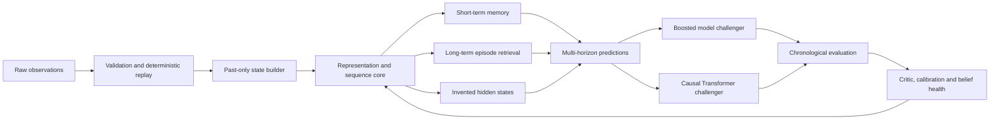

# AXIOM

AXIOM is an experimental predictive-intelligence project. The work started with visual representation learning, then grew into a broader question: can a model build useful internal states, remember how those states change, and make causal predictions from noisy sequences without being handed a fixed set of patterns?

The project is now well beyond the original VAE prototype. It includes latent representation learning, transition models, causal sequence models, hidden-state discovery, episodic memory, belief retirement, deterministic replay, and strict chronological evaluation. Financial markets are one demanding test environment for the system, but the main work is the design of the learning architecture itself.

This repository is a public research summary. The larger datasets, model artifacts, and replay archives are kept private because of their size.

## Current Research System

```mermaid
flowchart LR
    A[Raw observations] --> B[Validation and deterministic replay]
    B --> C[Past-only state builder]
    C --> D[Representation and sequence core]
    D --> E[Short-term memory]
    D --> F[Long-term episode retrieval]
    D --> G[Invented hidden states]
    E --> H[Multi-horizon predictions]
    F --> H
    G --> H
    H --> I[Boosted model challenger]
    H --> J[Causal Transformer challenger]
    I --> K[Chronological evaluation]
    J --> K
    K --> L[Critic, calibration and belief health]
    L --> D
```

The design deliberately separates what the model knew at decision time from what happened later. Runtime evidence and future labels live in different tables, targets cannot cross collection boundaries, and model selection uses earlier tuning data rather than the final diagnostic slice.

## What We Have Built

### Representation and latent memory

The first AXIOM experiments used variational autoencoders to compress observations into reusable latent vectors. We tested whether those vectors could reconstruct the original input, survive export and reload, and support a second memory-style decoder without rerunning the complete pipeline.

That phase established the basic idea of a learned internal state, but reconstruction alone was not enough. A model can reproduce an observation without understanding why it changed.

### Transition and world modeling

The next stage added patch-based Transformers, discrete stochastic latents, transition prediction, reward/value heads, and walk-forward evaluation. Instead of only asking the model to recreate the present, we asked it to estimate how the state could evolve and to represent uncertainty over several possible futures.

This work exposed an important limitation: accurate-looking averages can hide weak directional reasoning. That led us away from single headline accuracy numbers and toward path forecasts, uncertainty, likely pain, favourable movement, and state-transition quality.

### Hidden-state and causal discovery

We built controlled simulations where an observable entity was affected by direct causes, indirect causes, delayed effects, noise, and unobserved variables. The learner had to infer relationships from how variables changed over time rather than from hard-coded state names.

The resulting prototype studies:

- how much one variable changes another per unit time;
- direct effects, indirect effects, and changing delays;
- hidden causes that alter several visible relationships at once;
- confidence based on repeated causal chains rather than one correlation;
- separate short-term sequence memory and long-term episode summaries;
- stale beliefs that move from trusted to warning, suspended, and retired;
- specialised sub-models that share evidence only when it improves another model.

Several simpler baselines, including logistic regression and boosted trees, were kept in the experiments. When a simpler model won, we treated that as useful evidence about the task rather than hiding it.

### Causal predictive modeling

The latest research system works from ordered multi-source event streams. It reconstructs state, produces past-only decision snapshots, and predicts future paths at multiple horizons. Boosted table models and causal Transformers receive the same evidence so the comparison is fair.

The current architecture combines:

- a shared sequence core for behaviour that repeats across related systems;
- private adapters so each exact system can keep its own behaviour and memory;
- independent challengers for cases with enough evidence to support a separate model;
- episodic retrieval of similar completed sequences;
- separate long, short, entry, exit, uncertainty, and risk estimates;
- a critic that tracks whether a belief still works and retires it when repeated failures accumulate.

Rust handles deterministic replay, state reconstruction, simulation, feature generation, and storage. Python and PyTorch handle research, boosted learners, neural sequence models, and evaluation.

## Measured Progress

The old README highlighted grid-searched trade win rates. Those figures described selected thresholds on individual test slices, not a dependable measure of general predictive ability, so they are no longer used as the headline metric.

The latest verified data and modeling checkpoint is:

| Measure | Verified result |
|:--|--:|
| Ordered source events | 27,946,347 |
| Causal decision states | 3,128,310 |
| Block-bounded future-path targets | 2,427,164 |
| Simulated decision journeys | 813,213 |
| Long / short journey balance | 406,542 / 406,671 |
| Independent data blocks | 4 |
| Data sources | 6 venues |
| Exact systems tracked | 77 |
| Shared-model eligible systems | 62 |
| Private-adapter eligible systems | 63 |
| Independent challenger candidates | 8 |

The assembled dataset is 2.269 GiB across 87 files. Two complete assembly passes received the input partitions in different orders and produced the same content hash. This matters because the result should come from the evidence, not from accidental file ordering.

The current boosted-model stage trained 118 of 124 movement sides and 124 of 126 entry/exit sides. The missing sides were rejected because their chronological training partitions were too sparse, not silently filled or scored with weaker rules.

An earlier full diagnostic compared 63 boosted path models with 63 causal Transformers. Both families found limited short-horizon predictive signal over a zero-change baseline, with the clearest improvement concentrated in part of the data. The Transformer did not consistently beat the boosted models, and longer-horizon results were not strong enough to justify a broad claim. That result changed the architecture: the next model uses a shared causal core, private adapters, and independent challengers only where the evidence supports them.

## How Results Are Judged

AXIOM does not treat training accuracy as proof that a model understands a system. A result has to survive:

- chronological `70/15/15` learning, tuning, and diagnostic splits;
- a one-hour gap between splits to reduce information bleed;
- simple baselines such as zero-change, persistence, historical averages, and boosted tables;
- explicit checks for future-data leakage;
- separate reporting for different directions, horizons, systems, and evidence quality;
- save/reload equality and finite-prediction checks;
- repeated deterministic assembly with matching hashes;
- rejection when data, costs, timing, or coverage are not trustworthy.

This makes progress slower, but it prevents a lucky slice or a convenient metric from being mistaken for intelligence.

## What We Learned

The most useful result so far is architectural, not a single accuracy score.

1. **Prediction should describe a path, not only an endpoint.** The system estimates several future horizons, likely favourable movement, likely pain, and uncertainty.
2. **Memory needs two timescales.** Recent event sequences help with immediate changes, while completed historical episodes provide broader context.
3. **Hidden states should earn their place.** Invented states are kept only when they improve later predictions; otherwise they are bypassed or retired.
4. **Shared learning and individual behaviour both matter.** A shared core learns common structure, while private adapters preserve system-specific behaviour.
5. **Confidence must come from repeated evidence.** The model tracks how often a relationship held, when it last worked, how much damage it caused when wrong, and whether a newer explanation replaced it.
6. **A more complex model is not automatically a better model.** Boosted trees, linear baselines, latent models, and Transformers are compared on the same chronological evidence.

## Current Status

The deterministic data and table-model stages are working and independently audited. A real GPU smoke test passed causal-data checks, finite predictions, and exact model save/reload equality. Full boosted training completed, but strict coverage checks found a few sparse instrument-direction partitions that need repair before the shared Transformer stage is unlocked.

The next milestone is not to inflate an accuracy percentage. It is to finish the split-aware coverage repair, train the shared causal sequence core, attach private adapters, and test the frozen system on genuinely later data that did not exist when the models were selected.

AXIOM remains a research system. It has no authority to place orders or control capital, and the current results are not a profitability claim.
